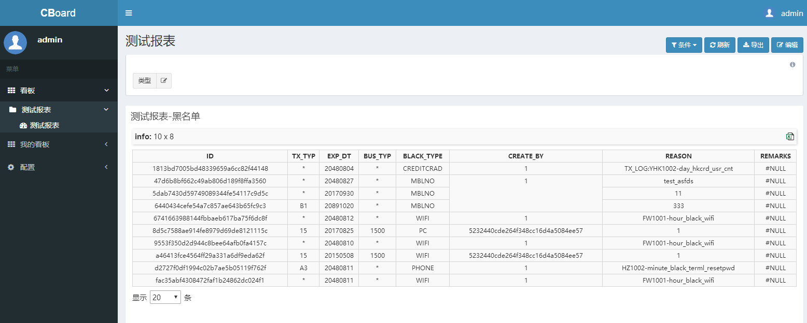
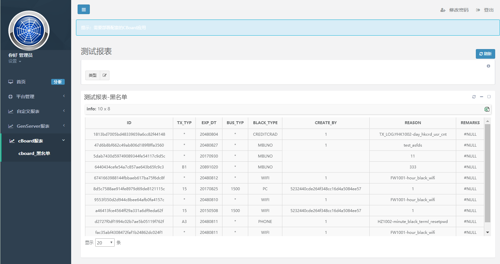
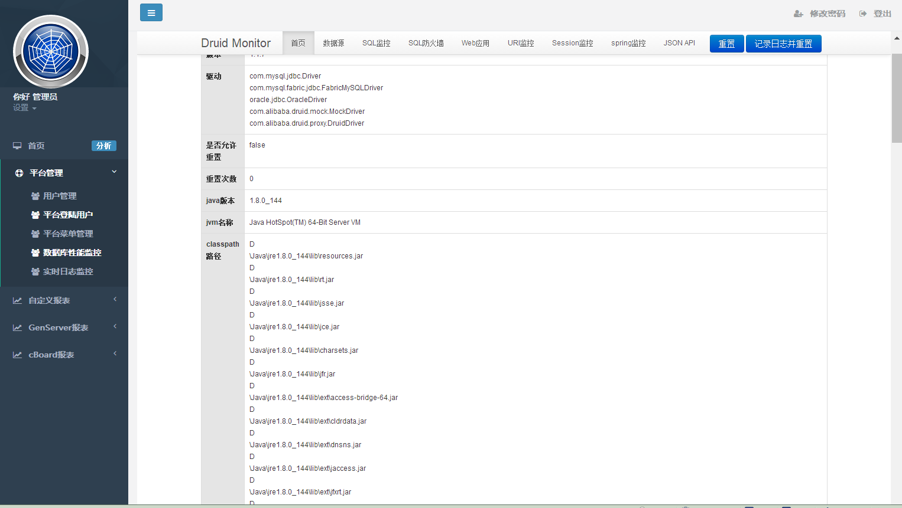
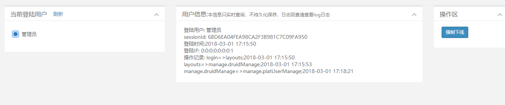
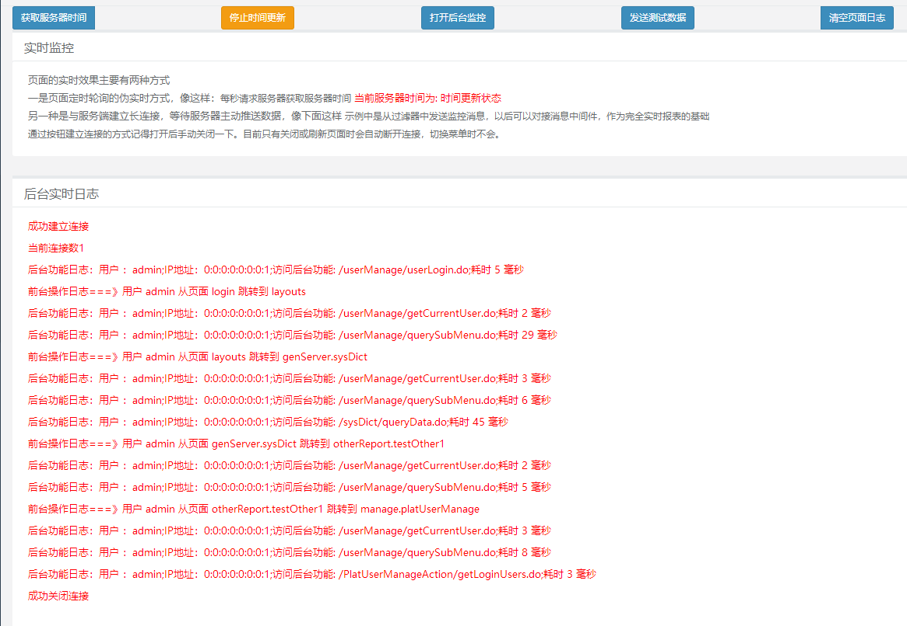
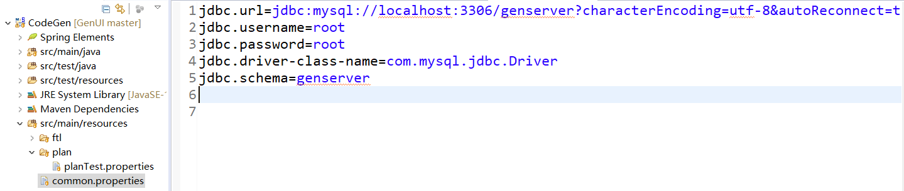
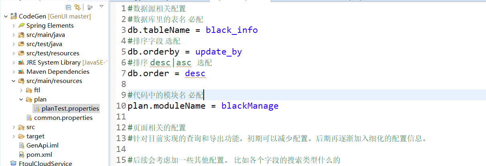
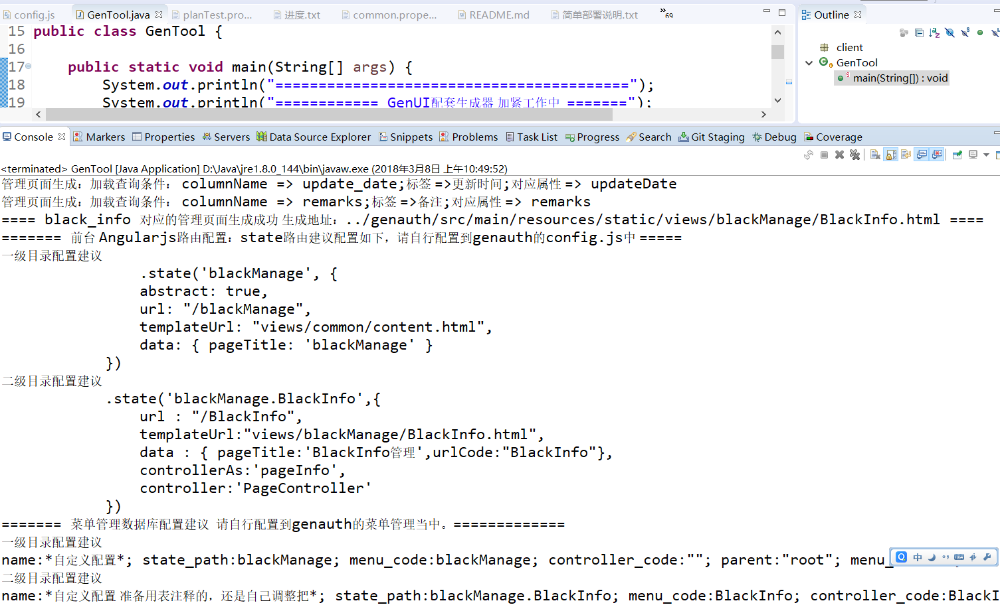
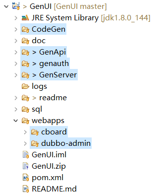

# GenUI
## 项目简介：  
在一般较大型的应用中，管理系统一般都是一个必不可少但是又不太愿意花功夫的小模块。希望新上一个管理系统，对基础数据进行管理、对历史数据做一些报表展示、不想花太多功夫，但是要有安全的权限管理、完善的系统监控、快速上手的开发模式、要有图形化的报表开发，还需要有能灵活适应公司体系的扩展性。。。。这些都想要。那来试试GenUI把。  
该项目脱胎于一个大数据分析平台，工作过程中几番升级，已经抽象出不错的易用性。具有以下几个不错的特点。  
#### &ensp;&ensp;一、业务数据源灵活。  
1、权限管理元数据、业务报表数据、CBoard报表数据，这些数据源目前都是完全独立管理的，这意味着后台数据可以更灵活的部署管理。  
2、目前能接入的数据源很丰富。 基于CBoard，本身就能很快的接入相当丰富的数据源。JDBC、ElasticSearch、HBase、txt、都可以用。 而自己开发的后台服务针对mysql和Oracle做了比较好的封装。  
3、基于Dubbo的分布式服务化管理，意味着你要加新的数据业务模块，接hdfs、solr、接公司自己的服务封装？OK，加个后台服务就行。  
#### &ensp;&ensp;二、权限管理灵活。  
1、自定义实现的权限管理，虽然肯定没有shiro那些健壮，但是绝对够用。而且扩展灵活。如果权限系统不是基于RBAC,而是基于更丰富的维度，部门、岗位、地域、或者其他乱七八糟的，自定义实现的就会比凑到shiro等框架上面看着更舒服。  
2、只基于页面和Controller层做权限控制。不管后台接入的数据源怎么样。权限系统都能全面的照顾到。  
#### &ensp;&ensp;三、快速上手的开发模式。  
1、基于CBoard的图形化报表开发工具，页面拖拽式的报表开发，老少皆宜、雅俗共享，简单易上手。  
2、针对Mysql和Oracle开发的后台服务模版，支持代码自动生成。开发简单，对技术人员快速上手也是个不错的途径。  
#### &ensp;&ensp;四、部署简单。  
1、CBoard和dubbo-admin，直接封装成了编译后的版本。不用管源码。简单粗暴。  
2、其他模块，基于springBoot+maven，编译，上手 so easy.
#### &ensp;&ensp;五、前面页面展现。  
1、基于 AngularJS+BootStrap ，天生支持多分辨率。平板、手机、PC一次搞定。  
2、页面风格 基于INSPINIA。 美观大气。  
反正这是个很好用的UI系统，目的就是让开发人员能够减少coding，更专心于业务，并且有个愉快的开发体验。

## 功能特性
### 1、集成大神开源的CBoard报表工具。还在为做报表头疼？试试这个，把报表交给业务人员自己去做。
	支持在cboard中开发的看板直接嵌入进来作为前端系统的一张报表。图形化的报表开发舒爽愉悦。
	具体配置只需要配置一个菜单statePath为 cboard.dashboard({id:看板ID})即可。快速简单。
	在CBoard中开发报表
  
	在报表系统中直接展现  
  
### 2、genauth前端，基于Angularjs和BootStrap开发，页面模版采用Inspinia。响应式布局，大气美观，而且天生兼容PC、平板、手机。
	。给一个人配置权限要找好几个页面跳来跳去，头晕眼花的？不存在。一个页面轻松搞定。
  
### 3、完善的监控功能。对平台运行情况，访问者操作全盘掌握。
	1》集成了alibaba的druid数据库连接池检控功能。简单通用。反应慢的功能模块，处理慢的SQL，及时了解。
	像这样：
  
	
	2》平台登录人数，访问路径，操作记录  一目了然。捣乱者一键踢下线。
	相比其他的管理平台，操作记录是比较有用的东西。之前有家公司基于这些数据可以分析平台的报表访问热度并挂钩一些部门的绩效。
	像这样：
  
	3》基于websocket实时日志监控。大屏监控平台运行情况，平台所有操作即刻了解。
	相比其他的管理平台，这个功能是真实时的，平台所有人的操作，实时上屏，大屏幕的视觉效果，高大上。
	像这样：
  
	
### 4、完善简洁的权限管理系统。  
	没有使用拿来就用的shiro等其他框架，自行开发，功能不会比shiro少，最大的好处是灵活便于扩展。
	页面白名单、登录检查、菜单权限，后台功能权限，页面控件权限一个都不少。
	对每个菜单，配置几个参数：
	statePath:Anguarls router的state路径。--具体参见Angularjs资料。
	menuCode:菜单权限标识。主要用于控制登录后左侧菜单的权限以及访问路径的权限。
	ControllerCode:菜单后台访问权限。基于一个Controller给一个菜单提供数据的模型建立。配置后台Controller的类名，用于控制后台访问权限。
		--由于后台数据由基于dubbo的服务提供者来提供，genauth中的Controller仅仅只作为一个通道来使用。因此这种设计约定应该是没有什么问题的。
	pageCode:用于控制菜单页面控件的权限标识。目前采用默认的_export(导出)和_query(查询)两个页面标识，不需要配置。
		在项目使用过程中基本够用了，如果需要可以进行扩展。后续如果有时间，可以改成配置式的。
	
### 5、简单报表代码自动生成。  
    自带的GenServer服务模块，作为一个后台服务的模版，集成了一套基于Bean注解的快速表格生成实现。并基于这种实现开发了代码自动生成功能。
      
  
  
  --数据的修改和删除理论上应该由后台服务提供者自行控制。这里只提供简单的封装，当然，以后也是想要把这一套封装做得更完善。

## 环境依赖
### 1、关系型数据库，建议Oracle
	#### 主要配置文件说明：
		1》genauth和GenServer：主要要修改的配置文件通过对主启动类配置运行参数 -Dboot.env=XXX进行指定。对应的配置文件为application.properties和application-XXX.properties
		主要需要维护数据库地址和zookeeper地址。
		2》dubbo-admin：主要要修改的配置文件为dubbo.properties。 主要维护zookeeper地址。详细配置参见dubbo官方文档。
		3》cboard：主要要修改的配置文件为 /WEB-INF/classes/config.properties 和 /WEB-INF/classes/spring-dubbo-server.xml
		第一个配置文件主要修改数据源地址。可以单独部署，建议与genauth的管理元数据配置到一起。
		第二个配置文件主要修改外部zookeeper的地址。
	#### 数据源维护说明：三个数据源与主要功能模块一起进行了区分管理，具体项目中想要怎么玩，自己定就行。
		1、管理元数据：genauth使用的元数据库。初始化脚本在sql/genauth下。主要维护权限相关信息，实际项目中基本不需要调整
		2、cboard管理元数据库：cboard使用的管理元数据库。初始化脚本在sql/cboard。 大神的项目结构，最好不要动。
		3、后台管理数据：GenServer使用的具体业务数据库。初始化的页面快照、字典等几个基础功能的初始化脚本在sql/GenServer下。
			--note:在这个微服务架构体系下，服务提供者是根据业务灵活定制的部分。这里只是一个模版功能。

### 2、zookeeper，服务注册中心,后续会准备基于zookeeper再做一些其他有趣的功能。  --开发调试版本3.4.5

## 部署步骤
### 1、外部依赖的zookeeper,单独进行启动。
### 2、将webapps下的cboard和dubbo-admin复制到servlet容器中(例如tomcat的webapp)目录。启动(配置文件根据环境自行维护好)
	--启动后可以进入dubbo-admin页面查看到cboard往dubbo注册的服务。
### 3、启动GenServer注册服务。为spring boot开发的一个服务后端。其他服务可以自行通过dubbo扩展。
	--spring boot程序的部署方式不做详细讲解，只做简单的说明。不懂的可以度娘。
	开发环境启动方式为直接启动主启动类ServerApplication.java 需要配置-Dboot.env=XXX参数。
	服务器端部署方式为定制一个开发脚本 最终调用 java -cp {runlib/*.jar GenServer.jar} com.genService.ServerApplication.java -Dboot.env=XXX 1>{logfile} 2>&1
	--启动后可以进入dubbo-admin页面查看到genServer往dubbo注册的服务
### 4、启动主体应用genauth。为spring boot开发的应用。具体部署参见上面。
	--初始化的示例版本中，genauth配置为启动依赖GenServer提供的服务，而不依赖cboard提供的服务。因此理论上需要启动GenServer后才能启动。
	--服务的依赖检查参看dubbo官方文档。

## 目录结构描述

1. genauth:主体框架。spring-boot架构， 主要功能包括管理元数据维护、前台页面展示。
2. GenServer:后台服务框架。spring-boot架构，主要功能为通过dubbo给genauth提供数据支持。
3. GenApi:dubbo服务提供者与消费者交互的接口。主要维护service接口和POJO。
4. CodeGen: 基于genauth和GenServer的快速代码生成模块。
5. webapps/cboard:开源报表工具cboard 0.4.1版本的修改版本。同样是编译后的版本，拿来就用。默认登录账户 admin/root123
6. webapps/dubo-admin:基于dubbo2.5.8版本编译的dubbo监控服务，不用管源码，拿来就用。  
7. zookeeper GenUI外部依赖的zookeeper。--开发调试用的3.4.5版本。

## 版本内容更新  
2018年3月8日 增加代码生成模块。
2018年4月24日 增加自动生成报表的数据修改和删除功能。后期添加到计划配置中
2018年8月31日 自动生成报表的大量细节更新，包括通用查询改为使用mybatis进行查询，优化核心通用查询的兼容性；优化对date和timestamp的兼容性及格式化；html自动生成模版增加日期和时间选择控件；优化CBoard报表的js和css加载等。现在使用起来顺手多了。

## 声明 欢迎吐槽，欢迎高手指正 更欢迎提交代码
项目经历了有几家公司的实际应用，逐步完善起来。但是由于开源还在起步阶段，自己也只有闲暇时间才有时间维护。很多功能还需慢慢完善。  
	1、 代码自动生成。  
	目前已经完成了一套代码自动生成功能，以后准备对这一套功能进行扩展升级。 将对数据的CRUD操作全都包含进来。  
	2、更完善的监控。对于管理平台，安全始终是一个头疼费劲还不讨好的麻烦事情，后续希望能够帮助开发人员从这些东西中抽身出来，更多的关注业务。  
		预备基于访问日志做更多的整体监控以及运行报警，定时提醒等功能。  
	3、更高效的性能提升。  
	以后希望引入Docket配置， 引入动态页面静态化等功能。  
	4、更高的稳定性。  
	从前台页面到后台服务，继续加强系统的稳定性以及负载能力。  
	5、页面快照功能 --正在开发中  
	提交数据修改时，将页面保存下来，这比日志更管用。没错，很快就会有了。  
	6、其他管理功能扩展  
	比较别的管理平台，工作流、页面皮肤、平台聊天、邮件提醒，这些乱七八糟的东西，以后都会酌情慢慢丰富进来。
	

## 协议
	